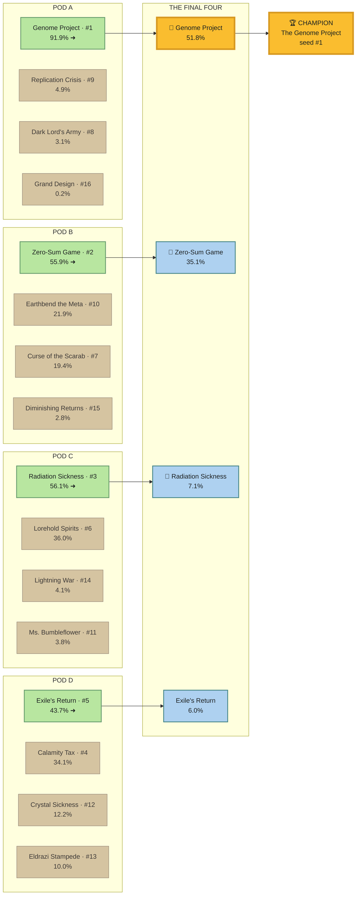

# The Pod Championship — 2026-06-15

*A tournament of the 16 active decks, run on the self-meta engine. The fun finale —
a celebration of the lab stack, scored on real curves. Not a deck-tuning ranking.*

**Engine:** `scripts/pod_championship.py` — reuses `self_meta_lab.py` unchanged (table-clock
race + durability overlay, `pod_gauntlet_clocks.json` curves). A per-game pod winner is the
earliest table-closer if anyone closes by `T_grind`; otherwise the most **durable** seat
outlasts. **Reproduce:** `python scripts/pod_championship.py` (default `T_grind=10`,
60k games/pod, 120k random pods for seeding).

**Format:** regular season (P(win | random 4-seat pod) → seeds 1–16) → group stage
(snake-seed into 4 balanced pods of 4: 1-8-9-16, 2-7-10-15, 3-6-11-14, 4-5-12-13;
highest win share advances) → Final Four (the 4 group winners; one pod) → champion.

---

## 🏆 CHAMPION: The Genome Project

**Won the crown in *both* the fast and grindy metas.** The only deck in the room with a
top-3 table clock (T8) *and* the close-race win in the final — it doesn't depend on the pace
of the field. Took its group at 91.9% and the final at 51.8%.

| | Fast meta (`T_grind=10`) | Grindy meta (`T_grind=8`) |
|---|---|---|
| 🥇 Champion | **The Genome Project** (#1) | **The Genome Project** (#1) |
| 🥈 Runner-up | Zero-Sum Game (#2) | The Dark Lord's Army (#2) |
| 🥉 Third | Radiation Sickness (#3) | The Calamity Tax (#4) |

---

## Regular season — seeds (fast meta, `T_grind=10`)

| Seed | Deck | Table | Never | Dura | P(win\|random pod) |
|---:|---|---:|---:|---:|---:|
| 1 | The Genome Project | T8 | 1% | 0.63 | **79%** |
| 2 | Zero-Sum Game | T9 | 25% | 0.59 | 51% |
| 3 | Radiation Sickness | T10 | 1% | 0.76 | 42% |
| 4 | The Calamity Tax | T10 | 14% | 0.78 | 36% |
| 5 | The Exile's Return | T10 | 12% | 0.79 | 35% |
| 6 | Lorehold Spirits | T10 | 5% | 0.61 | 31% |
| 7 | Curse of the Scarab | T11 | 9% | 0.67 | 24% |
| 8 | The Dark Lord's Army | T12 | 10% | 0.86 | 23% |
| 9 | The Replication Crisis | T10 | 20% | 0.71 | 18% |
| 10 | Earthbend the Meta | T11 | 7% | 0.73 | 16% |
| 11 | Ms. Bumbleflower | T11 | 2% | 0.75 | 12% |
| 12 | Crystal Sickness | T13 | 34% | 0.37 | 12% |
| 13 | Eldrazi Stampede Chaos | T12 | 8% | 0.55 | 10% |
| 14 | Lightning War | T14 | 39% | 0.66 | 6% |
| 15 | Diminishing Returns | >T14 | 70% | 0.46 | 4% |
| 16 | The Grand Design | >T14 | 82% | 0.44 | 1% |

## Group stage (fast meta)

- **Pod A — group of death.** Genome 91.9% ➜ · Replication 4.9% · **Dark Lord's Army 3.1%** ·
  Grand Design 0.2%. The judgment-#1 grind deck (Dark Lord, dura 0.86) is **eliminated in the
  group stage** — its T12 clock can't out-close Genome's T8 when the meta resolves by T10.
- **Pod B.** Zero-Sum 55.9% ➜ · Earthbend 21.9% · Curse 19.4% · Diminishing 2.8%.
- **Pod C.** Radiation 56.1% ➜ · Lorehold 36.0% · Lightning War 4.1% · Bumbleflower 3.8%.
- **Pod D.** Exile's Return 43.7% ➜ · Calamity 34.1% · Crystal 12.2% · Eldrazi 10.0%.

**Final Four:** Genome 51.8% 🥇 · Zero-Sum 35.1% 🥈 · Radiation 7.1% 🥉 · Exile 6.0%.

## The bracket

Source: `pod-championship-2026-06-15-bracket.mmd` (validated/rendered via Mermaid Chart).

## 🏅 Season Awards (data-backed superlatives)

| Award | Winner | The number |
|---|---|---|
| 🏆 **MVP / Champion** | The Genome Project | Won the crown in *both* metas; 79% self-meta, T8 clock |
| 🛡️ **Bring-this-vs-the-pod** | Radiation Sickness | 70% anti-pod (best on roster); counter-immune board kills |
| 🗿 **Grind King** (most durable) | The Dark Lord's Army | dura 0.86; self-meta judgment #1; rises to the Final Four at low `T_grind` |
| 📉 **Most Over-rated** (by score) | The Grand Design | 19/20 → **C tier**; 1% self-meta, 82% never-closes |
| 💎 **Quiet Overperformer** | Genome (15/20 → champ) & Zero-Sum (no score → A, 52% self-meta) | score says mid, results say elite |
| 🃏 **Cinderella** | The Exile's Return (#5) | lowest seed to win its group (Pod D, 43.7%) |
| 🤡 **Biggest Choke** | The Dark Lord's Army | the #8 seed / judgment-#1 deck, **out in the group stage** of the fast meta (3.1%) |
| 🔧 **Most Open Upgrade Path** | Ms. Bumbleflower | 0 Game Changers — room for 3 |
| 🚧 **Next Project** (the rebuild pile) | Eldrazi Stampede Chaos | lowest score (14) *and* bottom composite |

---

## The story the bracket tells

1. **Genome is the best deck in the room, period.** It wins regardless of `T_grind`. A fast,
   hit-all clock (pings every opponent → decap≈table) is the single most valuable property
   in a self-meta: it both closes the table first *and* survives the seeding into the final.
2. **The meta-pace knob (`T_grind`) reshuffles everyone *except* the champ.** Drop to a
   grindy `T_grind=8` and **Dark Lord's Army rockets from group-stage-out to #2 seed and the
   Final Four** — durability (0.86) and its opponent-fed Sauron engine finally get to decide
   games. Exile's Return / Calamity Tax (dura 0.78–0.79) climb with it. This is the same
   pivot `Self_Meta_Quantified_2026-06-15.md` documents: *grindy field rewards the fortress;
   fast field converges on the closers.*
3. **Survive ≠ close ≠ win.** The fortress decks (Dark Lord, Calamity, Exile) have the best
   durability indices but the worst table clocks. In a bracket that rewards *closing*, a high
   never% (Grand Design 82%, Diminishing 70%) is fatal — they seed last and exit first.

## Robustness — is the crown a fluke?

Re-ran across 5 seeds (1 / 7 / 42 / 2024 / 88888) and swept `T_grind` 6→14:

- **Seed-robust.** Genome wins *every* seed in both the fast (`T_grind=10`) and grindy
  (`T_grind=8`) metas. The crown is not a Monte Carlo artifact.
- **The only thing that flips the champion is the `T_grind` modelling knob — and only at its
  extreme.** Genome wins for all `T_grind ≥ 8`. At `T_grind ≤ 7` (a field where the table
  essentially *never* closes fast, so pure durability decides nearly every pod) **The Dark
  Lord's Army** takes the crown, Calamity Tax runner-up — the durability fortress finally in
  the regime it was built for. This is precisely the self-meta judgment (Dark Lord #1 for slow
  fields); the model and the judgment agree on the boundary.

| `T_grind` | Champion | Runner-up |
|---:|---|---|
| 6–7 | **The Dark Lord's Army** | The Calamity Tax |
| 8 | The Genome Project | The Dark Lord's Army |
| 9–14 | The Genome Project | Zero-Sum Game |

**Takeaway:** Genome is the champion across all realistic pace assumptions; only an
extreme-grind meta hands it to the durability king. Robust to randomness, sensitive (only at
the edge) to the one documented judgment knob.

## Honesty (gauntlet discipline, inherited)

- Table clocks are **unblocked goldfish ceilings** — no opposing interaction, blockers, or
  politics. The *ranking and the upsets* are the signal, not the win-share decimals.
- The **durability tiebreak and `T_grind` are documented judgment**, not a 4-body rules
  engine. There is no focus-fire targeting or combat math; "most durable outlasts" is an
  abstraction (same caveat as `self_meta_lab.py`).
- This is a **celebration**, not a ladder to retune a deck on. Real deck decisions go through
  the per-deck clock labs and `campaigns/Kill_Window_Lab_Sweep_2026-06-13.md`.
