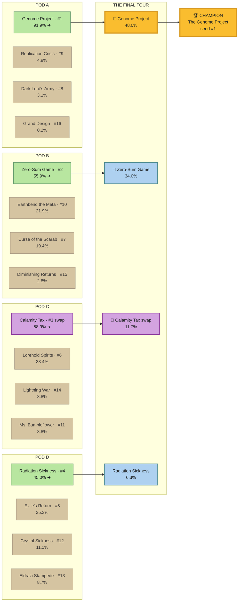

# The Pod Championship — ALL PROPOSED SWAPS APPLIED (2026-06-15)

*Companion to `Pod_Championship_2026-06-15.md`: the same tournament re-run with every proposed
swap from `Build_And_Swap_Tracker.md` §2 (encoded in `pod_gauntlet.SWAPS`) applied. Reproduce:
`python scripts/pod_championship.py --swapped`.*

## TL;DR — the crown does not move

**The Genome Project is still champion** — across all 5 seeds and the full `T_grind` sweep, in
both the fast and grindy metas. Applying the swaps changes **one thing**: the Calamity Tax
grind-fortress rebuild promotes it into the medals.

## Why almost nothing changes: the tournament races the *table* clock

The championship decides each game on the **table-close** clock. Of the five proposed swaps,
only one carries a new table curve:

| Swap | What it does | Table-clock effect | Effect on this tournament |
|---|---|---|---|
| **Calamity Tax** — grind-fortress rebuild | table T10→**T9**, never 14%→**4%**, dura 0.78→**0.83** | **moves** | **the only mover** — promotes Calamity |
| Grand Design — ramp + finisher | decap T10→T9 only | none (table unchanged) | inert here |
| Exile's Return — +Drannith / +Kiki | resilience + disruption | none | inert here |
| Replication Crisis — +Kiki line | resilience (~5% goldfish) | none | inert here |
| Diminishing Returns — +Deathmantle/Grave Titan | combo resilience | none | inert here |

The other four add **decap speed or resilience the table goldfish can't score** — exactly the
"reliability/resilience upgrades the goldfish can't see" finding from the swap analysis. They're
genuinely applied in the `--swapped` run; they just don't register on this metric. (To see the
decap/disruption swaps pay off, look at the anti-pod gauntlet — `pod_gauntlet.py --swapped` —
not this table-clock tournament.)

## What *does* change: Calamity Tax crashes the podium

| | Baseline | All swaps applied | Δ |
|---|---|---|---|
| Calamity seed | #4 (36%) | **#3 (45%)** | ▲ +1 seed, +9pp |
| Calamity finish | group stage (lost Pod D to Exile) | **🥉 Final Four (11.7%)** | ▲ onto the podium |
| Pushed off the podium | — | The Exile's Return (was 4th) | ▼ out of the Final Four |
| Champion | The Genome Project | **The Genome Project** | = unchanged |
| Runner-up | Zero-Sum Game | **Zero-Sum Game** | = unchanged |

The reseed (Calamity #4→#3) bumps Radiation Sickness to #4; in the new snake bracket Calamity
takes Pod C (58.9%) and Radiation takes Pod D (45.0%), so **both** reach the Final Four while
**Exile's Return drops out**. Net podium change: Exile (4th) → Calamity (🥉).

## The swapped bracket

Source: `pod-championship-2026-06-15-swapped-bracket.mmd` (validated via Mermaid Chart). Purple
= the swapped deck.

## Robustness (swapped)

| `T_grind` | Champion | Runner-up |
|---:|---|---|
| 6–7 | The Dark Lord's Army | **The Calamity Tax (#2)** |
| 8 | The Genome Project | The Calamity Tax (#3) |
| 9–14 | The Genome Project | Zero-Sum Game |

Same shape as baseline — Genome for `T_grind ≥ 8`, Dark Lord's Army at the extreme-grind edge.
The swap's mark: in the grind meta Calamity climbs to the **#2 seed** and becomes the clear
runner-up, but its durability (0.83) still falls short of Dark Lord's (0.86), so the grind king
keeps the throne. Genome's crown is untouched by the swaps at every pace and seed tested.

## Verdict

The proposed swaps are **correctly aimed** — Calamity's rebuild does exactly what it was built
to do (it goes from a non-factor to a Final-Four / grind-runner-up deck). But they are **not
a title threat**: nothing in the swap slate closes the table faster than Genome's T8 hit-all
clock. If the goal is to dethrone the champion, the lever isn't on the swap list — it's a deck
that closes a 3-seat table by T7–T8. (Caveats inherited from the base championship: goldfish
table ceilings, soft durability/`T_grind` judgment.)
