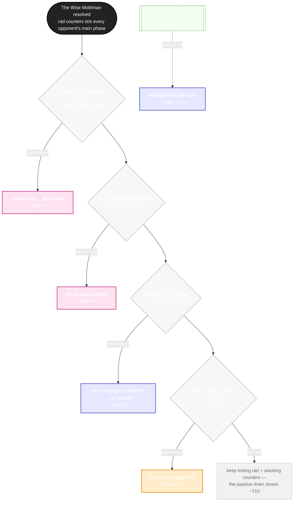
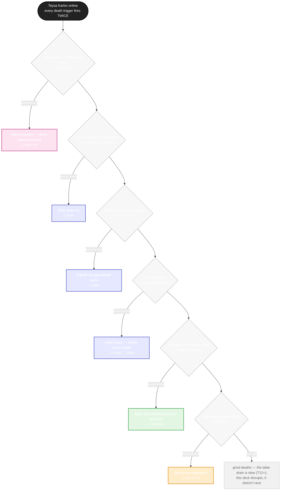

# Kill trees — a deck's win lines as a decision diagram

Backlog #4. Each tree reads top-to-bottom as the decision a pilot actually makes:
**try the fastest available kill line; if its pieces aren't assembled, fall to the
next.** The lines, their pieces, and their clocks come straight from the deck's
`*_clock_lab.py` (KILL CHECKS, cheapest-first) and its audited Summary — this is
pure visualization, not a new model.

Leaf colours: 🩷 **combo** (deterministic/loop) · 💜 **table** (all-opponent
drain/poison) · 🧡 **combat** (focus-fire one opponent = decap) · 💚 **enabler**
(tutor/reset that feeds another line). The dashed lane is an **always-on**
background clock that ticks regardless of which line you assemble.

Generate with `python scripts/kill_tree.py <deck>` (`--list` for encoded decks,
`--all` for every one); the `.mmd` files here are the output. GitHub renders the
fenced ` ```mermaid ` blocks below natively; the Mermaid Chart tool validated both.

---

## Radiation Sickness — The Wise Mothman

Five lines that nearly all kill the **whole table at once** (the rad/drain engine
hits every opponent), so decap and table converge — and a passive rad drain that
closes on its own around T10 even if no combo lands.



## Diminishing Returns — Teysa Karlov

Five distinct closing lines, all routed through Teysa (every death trigger fires
twice) — one deterministic loop, three drains, a reset, plus a tutor that can
fetch the missing piece of any of them. The table clock is slow (T12+): this deck
disrupts and grinds, it doesn't race.



---

*Adding a deck: encode its lab's KILL CHECKS (cheapest-first) into `DECKS` in
`scripts/kill_tree.py` — id, pieces needed, kill, lab clock, kind — then
`--all`. Keep the clocks lab-sourced so the picture stays honest.*
