# Kill trees — a deck's win lines as a decision diagram

Backlog #4. Each tree reads top-to-bottom as the decision a pilot actually makes:
**try the fastest available kill line; if its pieces aren't assembled, fall to the
next.** The lines, their pieces, and their clocks come straight from the deck's
`*_clock_lab.py` (KILL CHECKS, cheapest-first) and its audited Summary — this is
pure visualization, not a new model.

Leaf colours: 🩷 **combo** (deterministic/loop) · 💙 **table** (all-opponent
drain/poison) · 🧡 **combat** (focus-fire one opponent = decap) · 💚 **enabler**
(tutor/reset that feeds another line). The dashed lane is an **always-on**
background clock that ticks regardless of which line you assemble.

Styling is **dark-theme-safe**: every node sets an explicit text colour, so the
diagrams stay legible under a dark viewer (e.g. gruvbox in Obsidian) where nodes
otherwise inherit a light foreground and wash out, as well as on GitHub light/dark.

Generate with `python scripts/kill_tree.py <deck>` (`--list` for encoded decks,
`--all` for every one); the `.mmd` files here are the output. GitHub renders the
fenced ` ```mermaid ` blocks below natively; the Mermaid Chart tool validated them.
All **17 active decks** are encoded (the 4 detailed showcases below, then the rest);
the dashboard deck pages render the same ladders natively.

---

## Radiation Sickness — The Wise Mothman

Five lines that nearly all kill the **whole table at once** (the rad/drain engine
hits every opponent), so decap and table converge — and a passive rad drain that
closes on its own around T10 even if no combo lands.


## Diminishing Returns — Teysa Karlov

Five distinct closing lines, all routed through Teysa (every death trigger fires
twice) — one deterministic loop, three drains, a reset, plus a tutor that can
fetch the missing piece of any of them. The table clock is slow (T12+): this deck
disrupts and grinds, it doesn't race.


## The Genome Project — Kuja, Genome Sorcerer

A **race leader** (decap T7 / table T8, lab `gp_clock_lab.py`). Unlike the combat
decks, Kuja's Wizard tokens ping **every opponent** on each noncreature cast, so
decap and table converge off the *same* ping clock instead of diverging. There's
no passive lane — pings need casts — so the ladder is an escalation: stack
multipliers for a one-spell kill, or chain cheap spells; the combat leaf is a
minor fallback, not a separate slow clock.


## The Replication Crisis — Satya, Aetherflux Genius

A **race leader** on the decap clock (T7) but with the clock **diverging** hard —
table is T10+ — because every line is combat-gated on Satya connecting. Two fast
alpha lines (infinite combats; Brudiclad conversion), a token-flood, a disruption
line, and a slow value grind as the fallback. The whole tree rests on protecting a
3/5: that's the deck's defining vulnerability, surfaced in the stall.


## Lorehold Spirits — Quintorius, History Chaser

Spirit go-wide off Quintorius's −4 alpha, a Purphoros table-ping line, and the Reveillark / Karmic Guide / Goblin Bombardment loop as the combo.

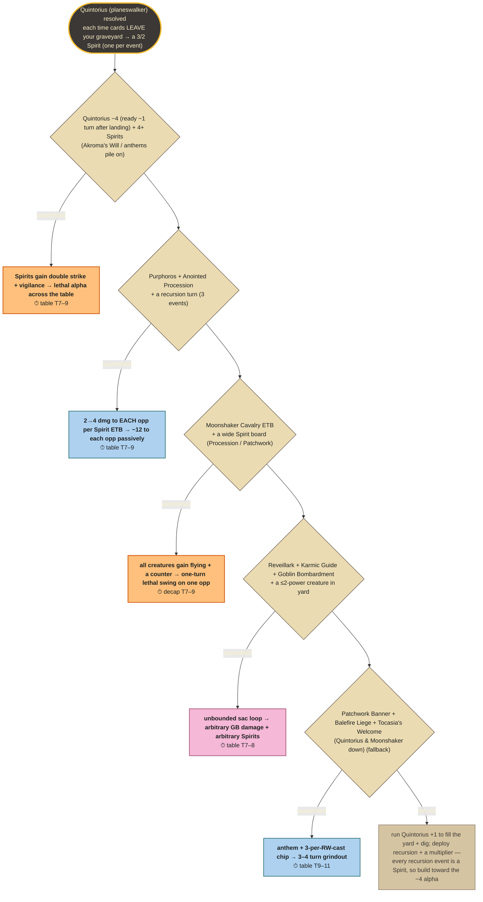

## Earthbend the Meta — Toph, the First Metalbender

Lands-matter: Scute Swarm + Purphoros table ping, Triumph infect, and All Will Be One counter-burn — decap and table both land in the T7–9 window.

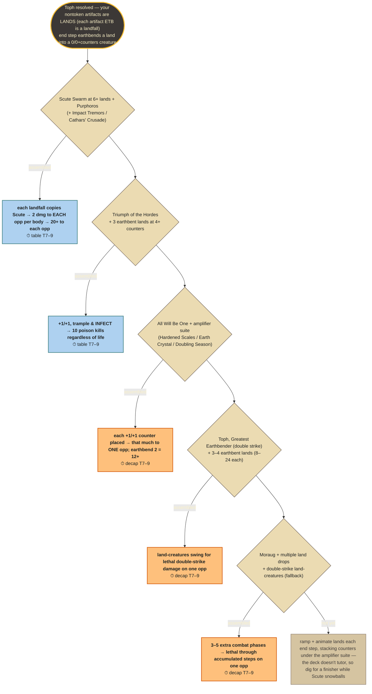

## The Exile's Return — Fire Lord Zuko

The Zuko counter-stack commander-damage line is the real clock (decap T8); the Hellkite Charger + Sozin's Comet infinite-combats is the rare marquee (table T10).

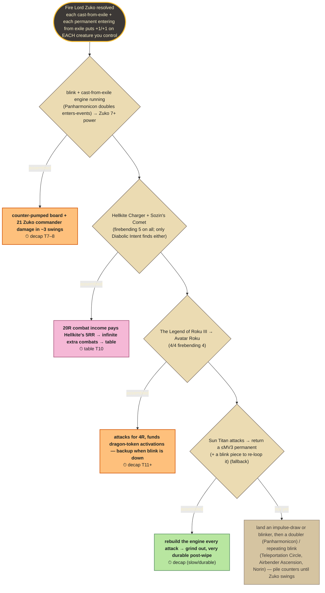

## Zero-Sum Game — Witherbloom, the Balancer

The Exquisite Blood lifeloop is commander-INDEPENDENT (table T9), with a Chain of Smog two-card drain and the slower affinity infinite as resilience.

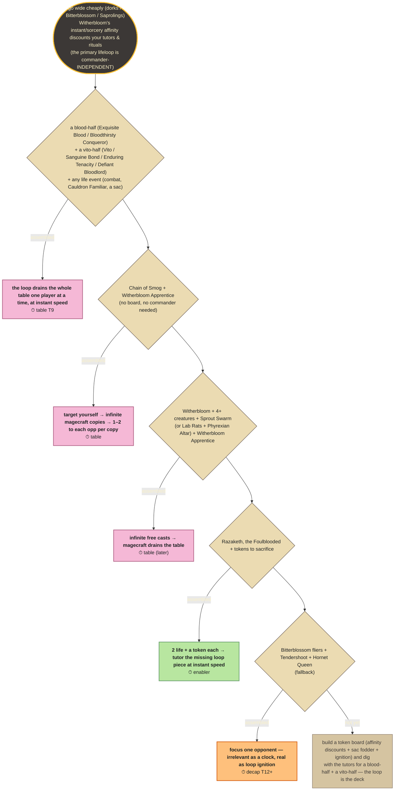

## Curse of the Scarab — The Scarab God

The Scarab God upkeep drain is the always-on table lane (~T11); Gray Merchant burst and lord-pumped combat are the faster decap (~T8).

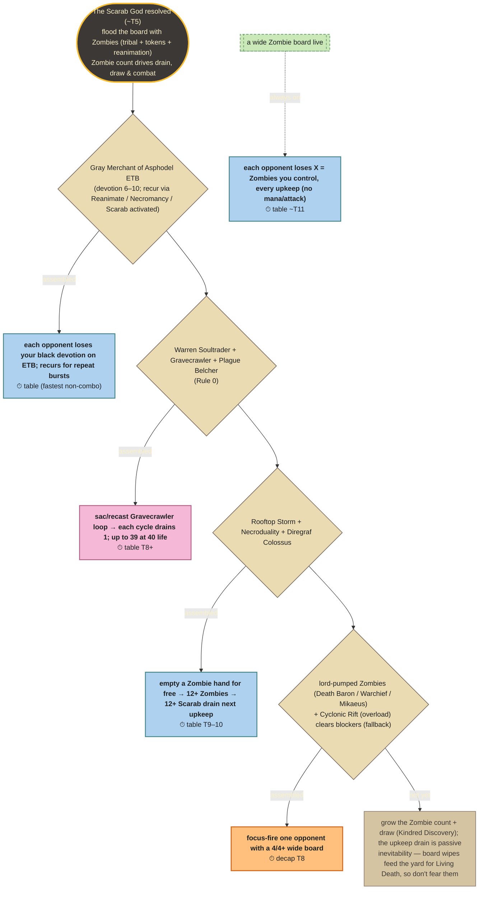

## Ms. Bumbleflower — Ms. Bumbleflower

A slow, combat-only kill: the Jolrael full-hand alpha (decap T8), Willbreaker theft, and evasive counter-beats — no infinite, no drain.

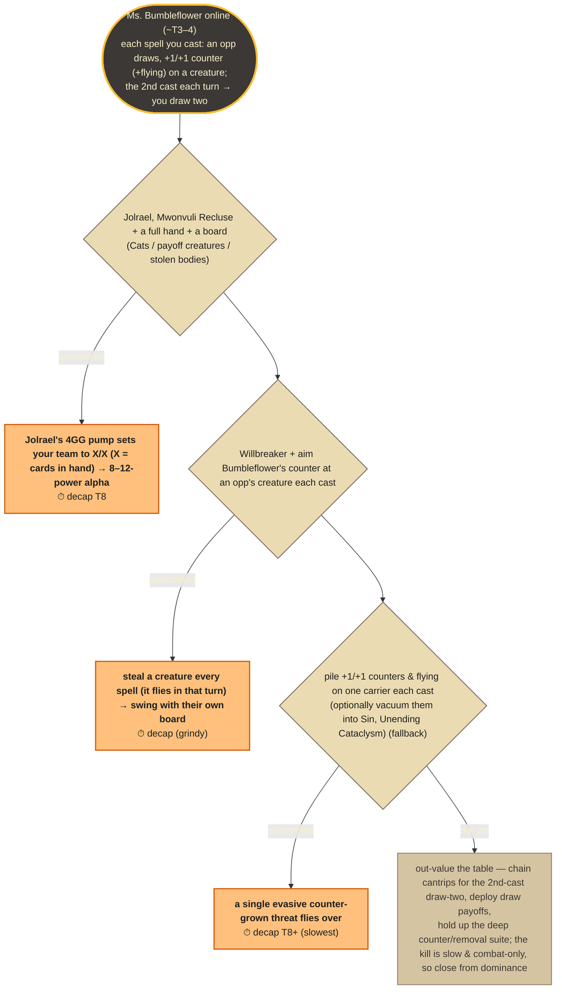

## Eldrazi Stampede Chaos — Maelstrom Wanderer

Ramp into Wanderer / Ghalta decap beats, with the Craterhoof trample-distribute table alpha as the real table kill (T12).

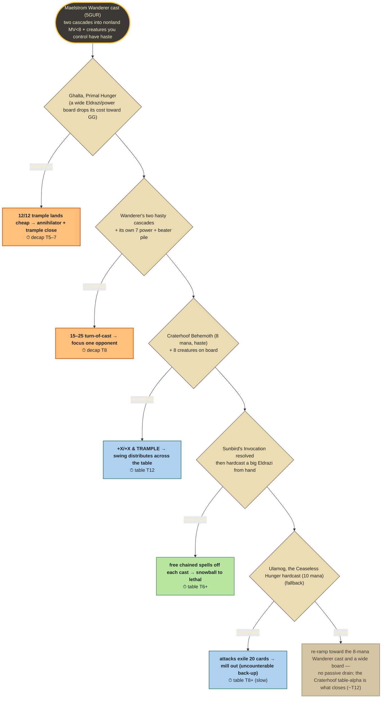

## The Dark Lord's Army — Sauron, the Dark Lord

Opponent-driven: an always-on draw-punisher drain (table T12) plus an evasive Orc Army decap and an aristocrats / reanimation grind.

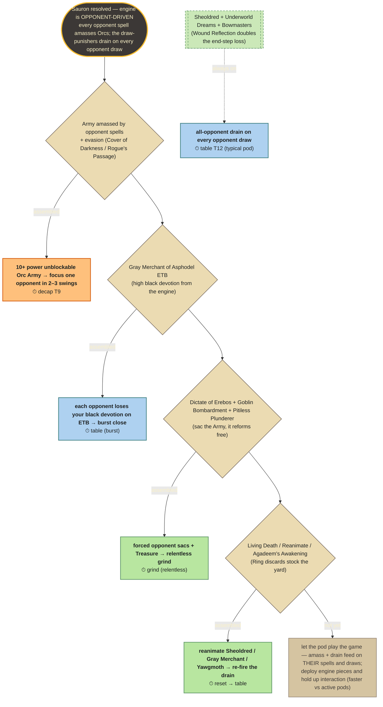

## Lightning War — Fire Lord Azula

Best-line: the Reiterate + Seething Song combo (table T9) raced against the X-burn / pinger chip on one game; Banefire deletes the counter-wall.

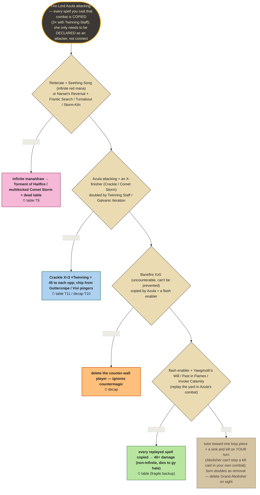

## The Grand Design — Atraxa, Grand Unifier

Craterhoof is the working finisher (decap T9, tutorable); Defense of the Heart cheats it in, Razaketh chains to it, and Finale X≥10 is the late ceiling.

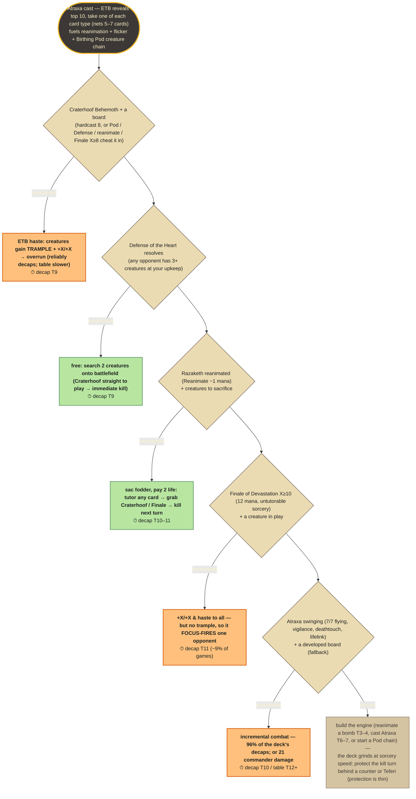

## Crystal Sickness — Golbez, Crystal Collector

Golbez's end-step drain off a binned high-power creature (Dreadnought 12) is the table clock (T13); Urza / Thopter combat decaps ~2 turns sooner.

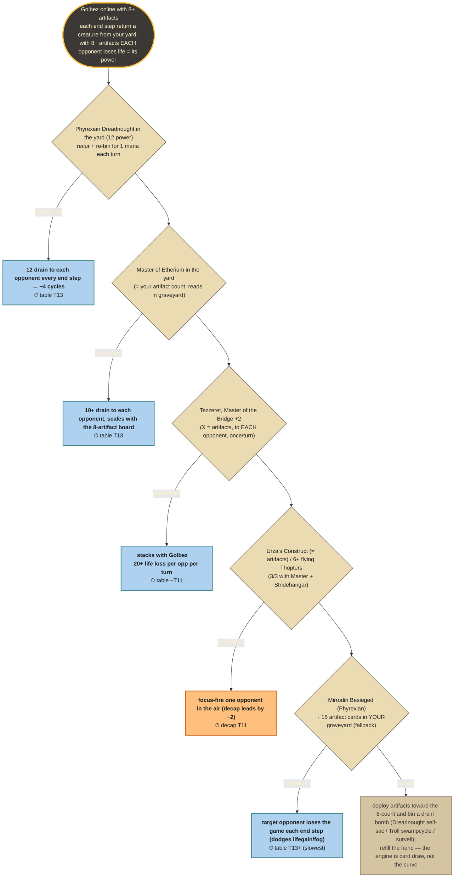

## Croak and Dagger — Glarb, Calamity's Augur

Glarb grind-fortress: Torment of Hailfire X=12+ (table T10) and a kicked Rite of Replication copy kill, backed by the Seedborn value engine.

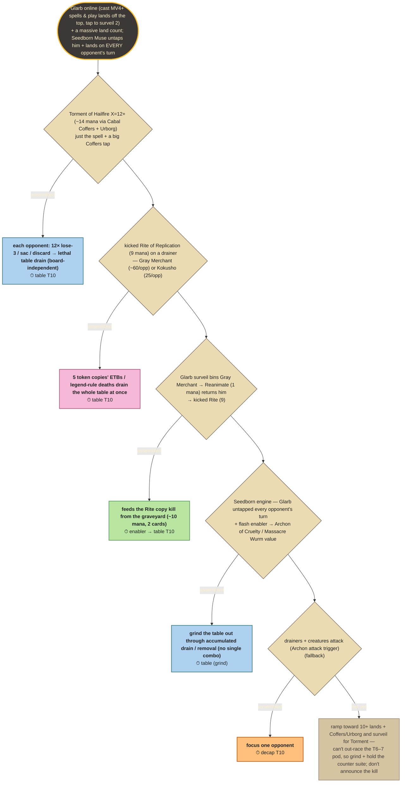

## Forced Liquidation — Kefka, Court Mage

A wheel cast on your turn feeding static draw-punishers (fires through Grand Abolisher): Notion Thief + Psychosis Crawler is the marquee table kill (T9).

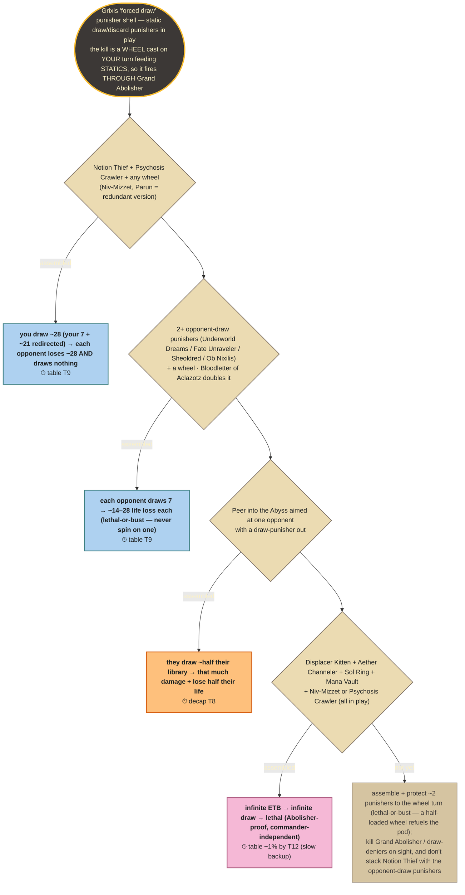

---

*Adding/refreshing a deck: encode its lab's KILL CHECKS (cheapest-first) into
`KILL_TREES` in `scripts/deck_registry.py` — id, pieces needed, kill, lab clock,
kind — then `python scripts/kill_tree.py --all` (regenerates the `.mmd`) and
re-bake the deck pages (the dashboard reads the same specs via
`kb_content._kill_tree`). Keep the clocks lab-sourced so the picture stays honest.*
