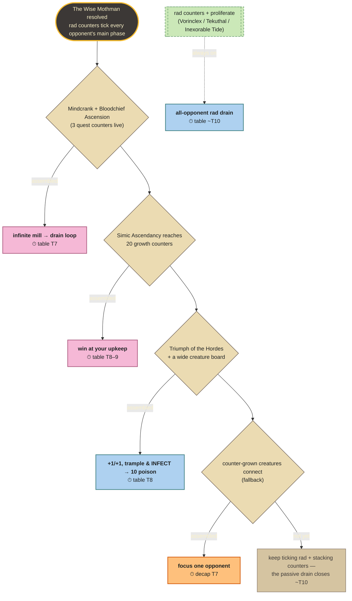
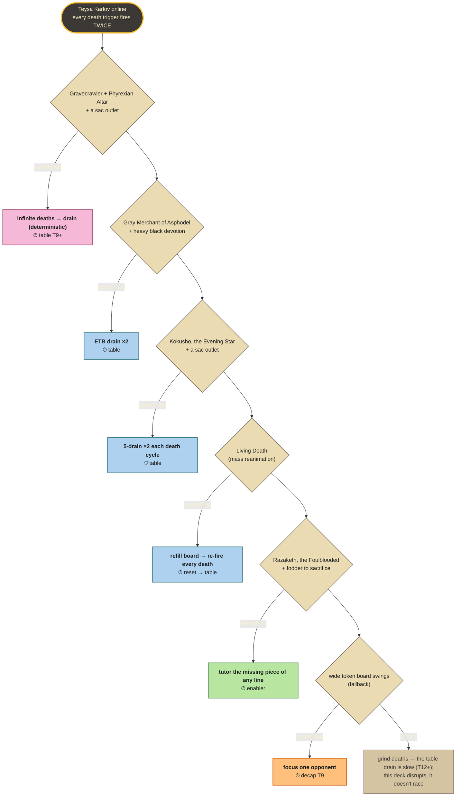
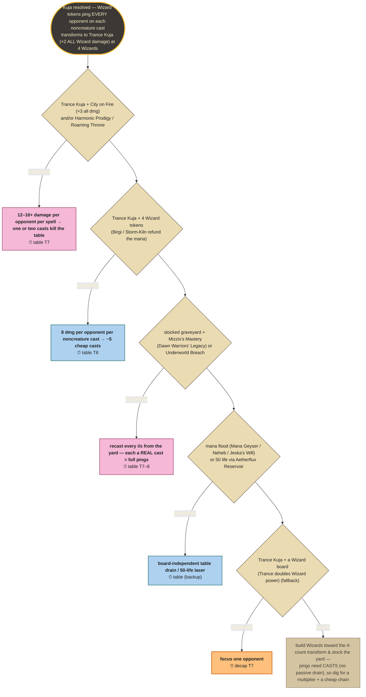
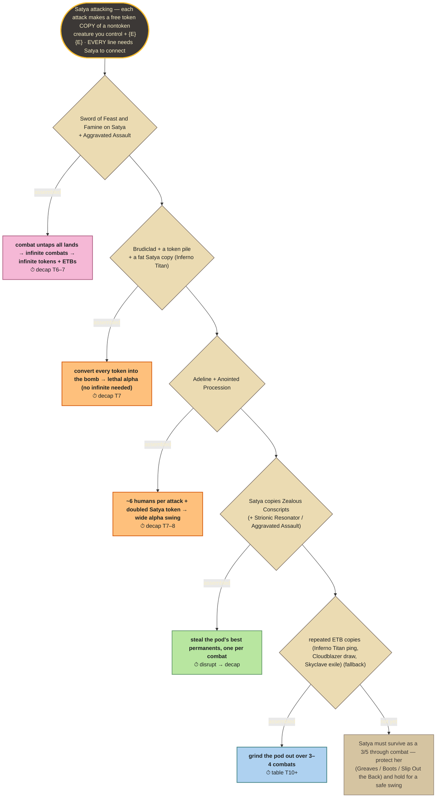

# Kill trees — a deck's win lines as a decision diagram

Backlog #4. Each tree reads top-to-bottom as the decision a pilot actually makes:
**try the fastest available kill line; if its pieces aren't assembled, fall to the
next.** The lines, their pieces, and their clocks come straight from the deck's
`*_clock_lab.py` (KILL CHECKS, cheapest-first) and its audited Summary — this is
pure visualization, not a new model.

Leaf colours: 🩷 **combo** (deterministic/loop) · 💙 **table** (all-opponent
drain/poison) · 🧡 **combat** (focus-fire one opponent = decap) · 💚 **enabler**
(tutor/reset that feeds another line). The dashed lane is an **always-on**
background clock that ticks regardless of which line you assemble.

Styling is **dark-theme-safe**: every node sets an explicit text colour, so the
diagrams stay legible under a dark viewer (e.g. gruvbox in Obsidian) where nodes
otherwise inherit a light foreground and wash out, as well as on GitHub light/dark.

Generate with `python scripts/kill_tree.py <deck>` (`--list` for encoded decks,
`--all` for every one); the `.mmd` files here are the output. GitHub renders the
fenced ` ```mermaid ` blocks below natively; the Mermaid Chart tool validated all four.

---

## Radiation Sickness — The Wise Mothman

Five lines that nearly all kill the **whole table at once** (the rad/drain engine
hits every opponent), so decap and table converge — and a passive rad drain that
closes on its own around T10 even if no combo lands.



## Diminishing Returns — Teysa Karlov

Five distinct closing lines, all routed through Teysa (every death trigger fires
twice) — one deterministic loop, three drains, a reset, plus a tutor that can
fetch the missing piece of any of them. The table clock is slow (T12+): this deck
disrupts and grinds, it doesn't race.



## The Genome Project — Kuja, Genome Sorcerer

A **race leader** (decap T7 / table T8, lab `gp_clock_lab.py`). Unlike the combat
decks, Kuja's Wizard tokens ping **every opponent** on each noncreature cast, so
decap and table converge off the *same* ping clock instead of diverging. There's
no passive lane — pings need casts — so the ladder is an escalation: stack
multipliers for a one-spell kill, or chain cheap spells; the combat leaf is a
minor fallback, not a separate slow clock.



## The Replication Crisis — Satya, Aetherflux Genius

A **race leader** on the decap clock (T7) but with the clock **diverging** hard —
table is T10+ — because every line is combat-gated on Satya connecting. Two fast
alpha lines (infinite combats; Brudiclad conversion), a token-flood, a disruption
line, and a slow value grind as the fallback. The whole tree rests on protecting a
3/5: that's the deck's defining vulnerability, surfaced in the stall.



---

*Adding a deck: encode its lab's KILL CHECKS (cheapest-first) into `DECKS` in
`scripts/kill_tree.py` — id, pieces needed, kill, lab clock, kind — then
`--all`. Keep the clocks lab-sourced so the picture stays honest.*
